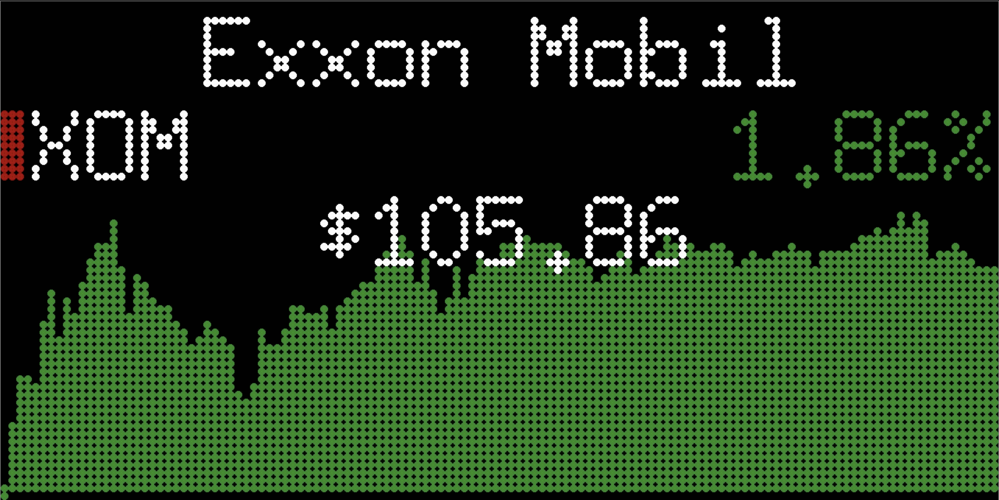
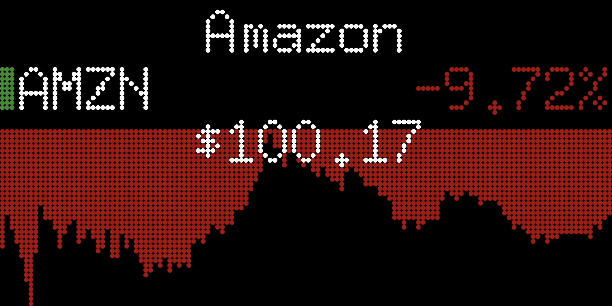
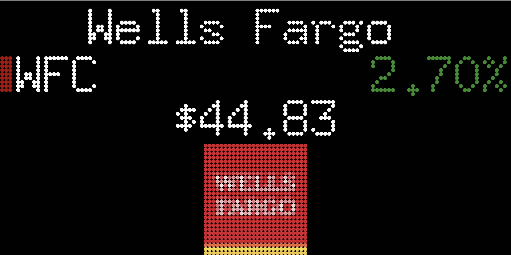
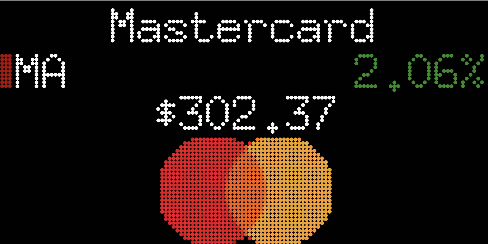

# LED Stock Ticker Display
***
<p align="middle">
  <a href="https://travis-ci.com/feram18/led-stock-ticker">
    
  </a>
  <a href="LICENSE.md">
    
  </a>
  
  <a href="https://github.com/feram18/led-stock-ticker/releases/latest">
    
  </a>
  
</p>

An LED display for real-time prices of stocks and cryptocurrencies. Requires a Raspberry Pi, and an LED board connected 
to the Pi via the GPIO pins.

<p align="center">
  
  
  

  
  
  
  <small>Version 0.3.1 (128×64)</small>
</p>

## Table of Contents
* [Features](#features)
* [Installation](#installation)
  * [Hardware](#hardware)
  * [Software](#software)
* [Usage](#usage)
  * [Configuration](#configuration)
  * [Flags](#flags)
  * [Execution](#execution)
  * [Debug](#debug)
* [Roadmap](#roadmap)
* [Sources](#sources)
* [Disclaimer](#disclaimer)
* [License](#license)

## Features
- **Real-time prices**. Display the real-time prices of your preferred stocks and cryptocurrencies.
- **Market status indicator**. Displays the stock market's current status (Located to the left of the ticker).
- **Ticker chart**. Chart with ticker's value change over the past day.
- **Currency selection**. You can select the currency you would like to see prices on. Check the list of supported 
currencies [here](config/README.md).

## Installation
### Hardware
Materials needed:
- [Raspberry Pi]
- Adafruit RGB Matrix [HAT] or [Bonnet]
- RGB LED Matrix. Supported sizes:
  - 64×32
  - 128×64

### Software
**Pre-requisites**

You'll need to make sure Git and PIP are installed on your Raspberry Pi, as well as Python 3.7+.

```sh
sudo apt-get update
sudo apt-get install git python3-pip -y
```

**Installation**

First, clone this repository. Using the `--recursive` flag will install the rgbmatrix binaries, which come from
hzeller's [rpi-rgb-led-matrix] library. This library is used to render the data onto the LED matrix.

```sh
git clone --recursive https://github.com/feram18/led-stock-ticker.git
cd led-stock-ticker
chmod +x install.sh
./install.sh
```

**Updating**

From the `led-stock-ticker` directory, run the update script. The script will also take care of updating all 
dependencies.

```sh
./update.sh
```

## Usage
### Configuration
A `config.json.example` file is included for reference in the `config` directory.  After installation has been 
completed, run the configuration script to set your preferences.

```sh
./config.py
```

The `config.json` file follows the following format:
```
  "tickers":                      Options for stocks and cryptocurrencies preferences
    "stocks"          Array       Pass an array of stock symbols
                                  Example: ["TSLA", "AMZN", "MSFT"]
    "cryptos"         Array       Pass an array of cryptocurrency symbols
                                  Example: ["BTC", "ETH", "LTC"]
                                  
  "options":                      Other miscellaneous preferences
    "currency"        String      Currency in which to display prices
                                  Example: "EUR" (Default: USD)
    "clock_format"    String      Sets the preferred clock format
                                  Accepted values are "12h" and "24h" (Default: 12h)
    "date_format"     String      Sets the preferred date format
                                  (Default: "%a, %b %d" - eg. Fri, Jan 14)
    "update_rate"     Integer     Rate at which data is fetched/updated (in minutes)
                                  (Default: 10min)
    "rotation_rate"   Integer     Rate at which tickers will rotate (in seconds)
                                  (Default: 10sec)
    "show_logos"      Boolean     Display company stock & cryptocurrency logos in place
                                  of history charts. (Default: false)
```

Additionally, you will want to ensure the timezone on your Raspberry Pi is correct. It will often have London by 
default, but can be changed through the Raspberry Pi configuration tool.

`Localisation Options > Timezone > [Your Time Zone]`

```sh
sudo raspi-config
```

### Flags
The LED matrix is configured with the flags provided by the [rpi-rgb-led-matrix] library. 
More details on these flags/arguments can be found in the library's documentation.

```
--led-rows                Display panel rows. (Default: 32)
--led-cols                Display panel columns. (Default: 64)
--led-multiplexing        Multiplexing type: 0 = direct; 1 = strip; 2 = checker; 3 = spiral; 4 = Z-strip; 5 = ZnMirrorZStripe; 6 = coreman; 7 = Kaler2Scan; 8 = ZStripeUneven. (Default: 0)
--led-row-addr-type       Addressing of rows: 0 = default; 1 = AB-addressed panels. (Default: 0)
--led-panel-type          Chipset of the panel. Supported panel types: FM6126A; FM6127.
--led-gpio-mapping        Name of GPIO mapping used: regular, adafruit-hat, adafruit-hat-pwm, compute-module. (Default: regular)
--led-slowdown-gpio       Slow down writing to GPIO. Needed for faster Pi's and/or slower panels. Range: 0..4. (Default: 1)
--led-chain               Number of daisy-chained boards. (Default: 1)
--led-parallel            For Plus-models or RPi2: parallel chains. 1..3. (Default: 1)
--led-pixel-mapper        Apply pixel mappers: Mirror (Horizontal) = "Mirror:H"; Mirror (Vertical) = "Mirror:V"; Rotate (Degrees) = eg. "Rotate: 90"; U-Mapper = "U-mapper"
--led-brightness          Brightness level. Range: 1..100. (Default: 100)
--led-pwm-bits            Bits used for PWM. Range 1..11. (Default: 11)
--led-show-refresh        Shows the current refresh rate of the LED panel.
--led-limit-refresh       Limit refresh rate to this frequency in Hz. Useful to keep a constant refresh rate on loaded system. 0=no limit. (Default: 0)
--led-scan-mode           Progressive or interlaced scan. 0 = Progressive, 1 = Interlaced. (Default: 1)
--led-pwm-lsb-nanosecond  Base time-unit for the on-time in the lowest significant bit in nanoseconds. (Default: 130)
--led-pwm-dither-bits     Time dithering of lower bits. (Default: 0)
--led-no-hardware-pulse   Don't use hardware pin-pulse generation.
--led-inverse             Switch if your matrix has inverse colors on.
--led-rgb-sequence        Switch if your matrix has led colors swapped. (Default: RGB)
```

### Execution
From the `led-stock-ticker` directory run the command

```sh
sudo python3 main.py --led-gpio-mapping="adafruit-hat" --led-slowdown-gpio=2
```
Modify and include [flags](#Flags) as needed for your particular setup. Running as root is necessary in order for the 
matrix to render. Privileges are dropped after initialization.

### Debug
If you are experiencing issues, enable debug messages by appending the `--debug` flag to your execution command, logs are 
written to the `led-stock-ticker.log` file.

## Roadmap
- [X] Support currency selection
- [X] Display ticker charts
- [X] Create configuration script
- [ ] Layout Support (width × height)
  - [ ] 32×16
  - [X] 128×64
  - [ ] 128×32
- [ ] Forex prices
- [ ] Configuration web interface
- [ ] Board customization options
  - [X] Update rate
  - [X] Rotation rate
  - [X] Date format options
  - [X] Stock/Crypto Logos

## Sources
This project relies on the following:
- [YFinance] library to retrieve the stock/cryptocurrency data.
- [Exchange Rates] API for currency exchanges.
- [rpi-rgb-led-matrix] library to make everything work with the LED board, included as a submodule.

## Disclaimer
This project is a work in progress (all feedback is appreciated!) and is dependent on the [YFinance] library & 
[Exchange Rates] API relaying accurate and updated data.

## License
GNU General Public License v3.0

[Raspberry Pi]: <https://www.raspberrypi.org/products/>
[HAT]: <https://www.adafruit.com/product/2345>
[Bonnet]: <https://www.adafruit.com/product/3211>
[YFinance]: <https://github.com/ranaroussi/yfinance>
[Exchange Rates]: <https://exchangerate.host/>
[rpi-rgb-led-matrix]: <https://github.com/hzeller/rpi-rgb-led-matrix>